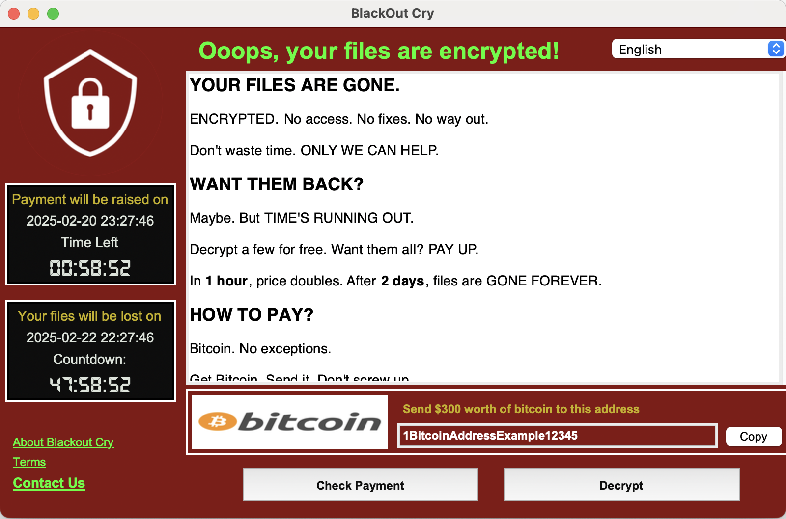

# BlackoutCryRansom Documentation



## Description

BlackoutCryRansom is a Python-based ransomware simulation application. It allows for the encryption and decryption of files using RSA encryption. The application provides a simple interface for users to interact with the program and perform the main operations of encrypting and decrypting files in a specific directory. It also handles key pair generation for encryption and decryption purposes.

## Features

- **Encrypt Files**: Encrypt all files in the specified directory using RSA encryption with the public key.
- **Decrypt Files**: Decrypt the encrypted files using RSA decryption with the private key.
- **Key Management**: The application generates a public/private key pair (if they don't exist) and uses these keys for encryption and decryption operations.
- **Cross-Platform**: The app will work on different operating systems but is primarily designed to run on macOS.

## Requirements

To run the application, make sure you have the following:

- Python 3.x
- `cryptography` library (`pip install cryptography`)

## How to Run

1. Clone or download the repository to your local machine.
2. Ensure you have Python 3.x installed along with the required dependencies (`cryptography`).
3. Make sure you're using the supported operating system (macOS is required for full functionality).
4. Navigate to the root folder where the script files are located.

To run the application:

```bash
python blackout_cry_ransom.py
```

### Menu Options

Once the program starts, you will be presented with the following options:

1. **Encrypt Files**: Encrypts all the files in the specified directory.
2. **Decrypt Files**: Decrypts previously encrypted files using the private key.
3. **Exit**: Exits the program.

**Note**: When encrypting or decrypting files, the files in the target directory are processed one by one.

## Folder Structure

```
.
├── blackout_cry_ransom.py    # Main application file to run
├── crypto.py                 # Handles encryption and decryption logic
├── ui                        # Folder containing the UI-related files
│   ├── ransomware_ui.py      # UI logic for the application
├── secrets                   # Folder where the private and public keys are stored
│   ├── private_key.pem       # Private key
│   ├── public_key.pem        # Public key
├── screenshots               # Folder containing the UI screenshot
│   └── image.png             # Screenshot showing the menu UI
└── utils.py                  # Utility functions
```

## Key Management

The program uses RSA encryption with keys stored in the `secrets/` directory. The keys are:

- **Private Key**: Stored in `secrets/private_key.pem`
- **Public Key**: Stored in `secrets/public_key.pem`

If the keys do not exist, they are automatically generated when the program first runs.

## License

This project is licensed under the MIT License - see the [LICENSE](LICENSE) file for details.